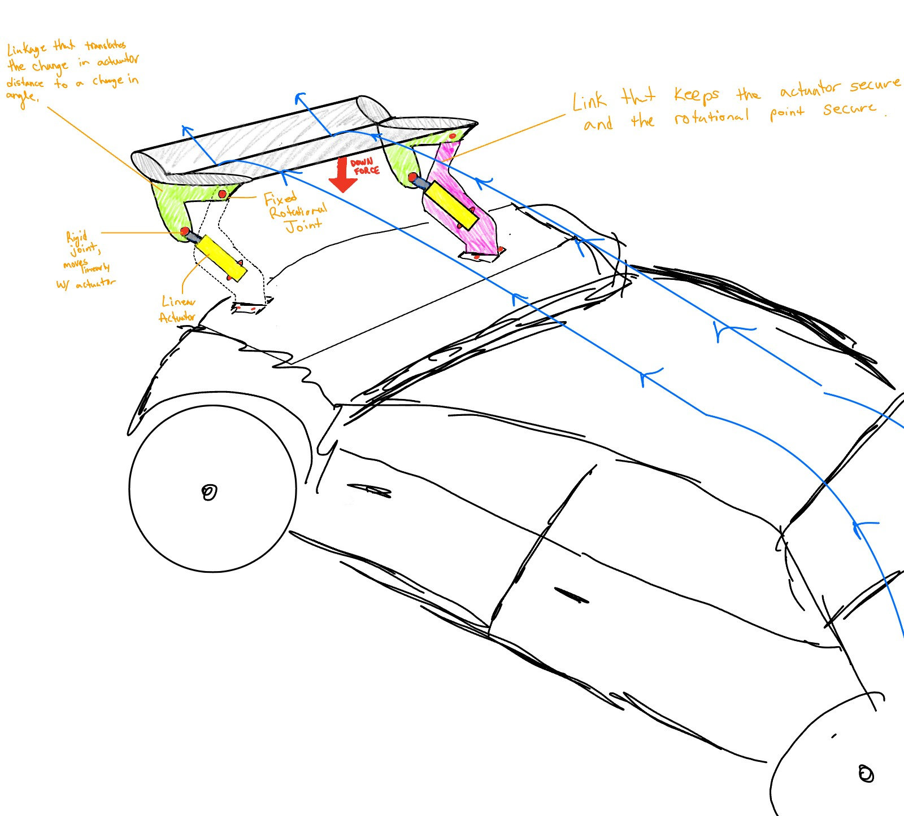
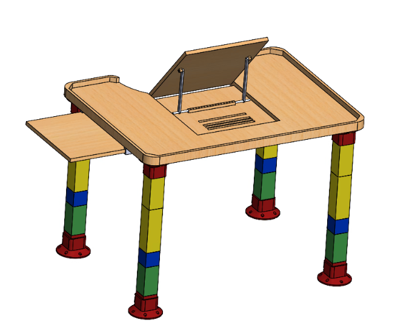
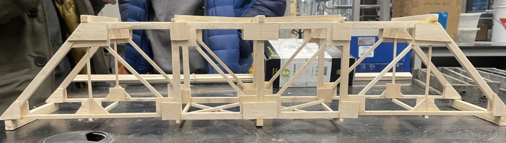
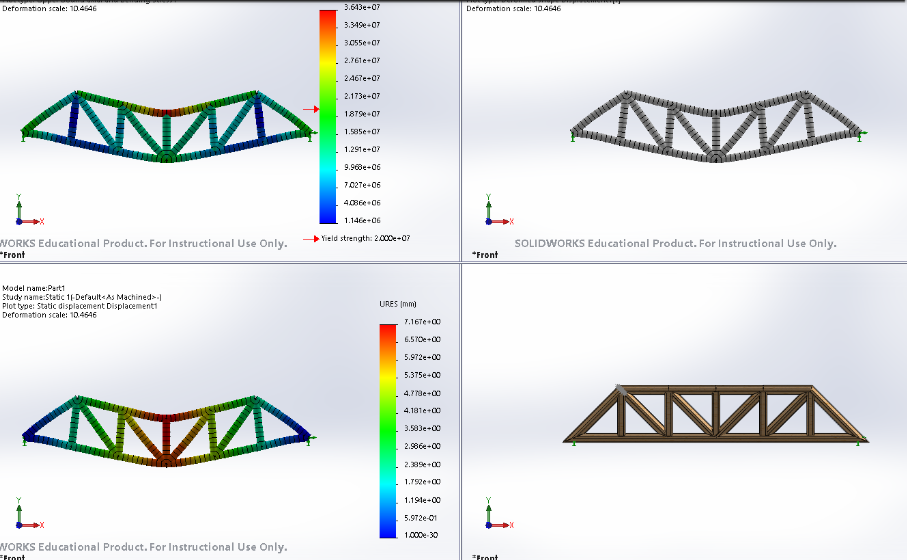

# Academic Portfolio

### BASc. Mechanical Engineering Student - University of Ottawa

Welcome to my portfolio, where I showcase my engineering projects, research, and technical problem-solving skills. 

As a fourth-year Mechanical Engineering student at the University of Ottawa, I have worked on many projects, from designing an active dynamic spoiler to developing an early warning malt and dust sensor for an industrial brewery. My experience spans structural design, sensor integration, and inclusive engineering, such as creating an accessible play table for children with disabilities. Through coursework and hands-on projects, including my involvement in Formula SAE as Drivetrain Lead, I apply system design, aerodynamics, and data acquisition to real-world challenges. Explore my portfolio, ordered by most recent completion, to see how I have been able to bring analytical thinking and creativity to engineering solutions alongside my peers.

 

# Formula SAE: GeeGee Racing Team
### </dd> Drivetrain Lead and Proud Member since February 2024

Over the past year, I've been a proud member of the Formula Student Team at the University, and I have been lucky enough to have taken on memorable engineering challenges and projects, refining both my technical and problem-solving skills. Throughout my time on the team I have bounced around roles, learning different components of the car through varying substeams. I began my journey as an aerodynamics associate where my studies revolved structural design and carbon fiber airfoil construction and have since become drivetrain lead where I analyse on-track telemetry and compare it to theoretical values for drive optimization. 

I am currently focusing on a slip angle analysis for oversteer/understeer and am in the beginning stages of a differential simulation. I am also taking on the redesign of the differential mounts with new changes being implemented to the engine and frame, thus requiring FEA and in depth load case analyses. This has allowed me to develop skills in research and data retrieval and has allowed me to be creative in my work, where I find true joy in being an engineering student. Beyond technical work, I’ve gained valuable experience in cross-functional collaboration, working closely with other subteams such as powertrain to integrate aerodynamic and cooling solutions efficiently. These past years have deepened my expertise in motorsports engineering, reinforcing my passion for high-performance vehicle development.

# Inverted Pendulum with PID Controller
#### uOttawa Control Systems Course [Jan-April 2025]

As part of a group of six, built a physical system constituting a cart with an inverted pendulum attached to it. Sourced standard electrical and mechanical components, such as wires, a DC motor, rails, fasteners, a belt drive, and other ancillary components. Carefully assembled the mechanical system. Using an Arduino Uno R3 microcontroller, a provided US Digital absolute angular encoder, and several software suites, tuned a PID (Proportional, Integral, Derivative) controller to keep the pendulum upright in response to perturbations to the system. Successfully presented the finished system to controls and system dynamics experts, and wrote a comprehensive report detailing the design and controller tuning processes. Associated with the MCG 3307 (Control Systems) course at the University of Ottawa.

### Check Out The Video Below!

# Machine Dynamics Simulation
#### uOttawa Dynamics of Machinery Course [Jan-April 2025]

As part of a group of three, simulated the movement of a pair of machines using MATLAB. Performed a preliminary analysis by hand, conceived an outline for the MATLAB script using a code flowchart, and carried out the code to obtain graphical representations of the machinery’s movement for a range of input conditions. Presented all of the acquired findings succinctly in a report. Associated with the MCG 3130 (Dynamics of Machinery) course at the University of Ottawa.

Link to simulation 1 [here](https://github.com/user-attachments/files/23535894/MCG3130.Simulation.1.-.Bryn.Stefanie.Amanda.pdf)  
Link to simulation 2 [here](https://github.com/user-attachments/files/23535904/MCG3130.Simulation.2.-.Bryn.Amanda.Stefanie.pdf)

# Active Dynamic Spoiler
#### uOttawa System Dynamics Course [Sept-Dec 2024]

As part of a course, my team and I developed an active rear aerodynamic spoiler that dynamically adjusts based on velocity, downforce, and drag to optimize performance. The system was modeled with MATLAB simulations and validated against publicly available NASCAR data. Through referencing the Circuit of The Americas (COTA) track, we analyzed how the spoiler could improve stability and efficiency across varying track conditions, adjusting for high-speed straights and tight corners. The project required a deep understanding of vehicle aerodynamics, control systems, and system dynamics modeling, making it an exercise in both theoretical analysis and practical application.

Link to project report [here](https://github.com/user-attachments/files/19041637/MCG.3306.-.Final.Project.Report.pdf)

 

# Aerodynamic Data Acquisition System: Research
#### uOttawa Electrical Engineering Course [Sept-Dec 2024]

As part of an aerodynamics-focused data acquisition project, my peer and I designed a system to capture real-time airflow and pressure data for the FSAE race car at uOttawa. The setup integrated differential pressure sensors, force-sensitive resistors (FSRs), and a temperature sensor to analyze downforce, airflow characteristics, and thermal behavior in the aerodynamic package.

Key components included:

-  Pitot tubes and mass flow sensors for measuring static and dynamic air pressure.  
-  FSRs mounted on aero surfaces to assess downforce distribution.  
-  Temperature sensors for monitoring brake or tire temperature in high-load conditions.  
-  Signal conditioning circuits, amplifiers, and filters to process sensor outputs before feeding them into a multiplexer and ADC for digital conversion.  

Overall, the project was a success, however, due to time constraints and an unfinished FSAE car, we have yet to apply the sensors to the electrical harness of the car in question. Once the car has been fully manufactured, I hope to be able to apply these sensors to the car to validate CFD simulations and improve the temperature stability / thermal behavior of the car and its brakes. Nevertheless, this project strengthened my expertise in sensor integration, circuit design, and data-driven performance optimization for high-speed vehicle applications.

Link to project report [here](https://github.com/user-attachments/files/19095108/ELG3336_FinalReport_Group.16.pdf)

# Accessible Table Design: Inclusive Engineering
#### uOttawa Project Management Course [Sept-Dec 2023]

For a manufacturing and design course, I worked with a team to develop an accessible play table tailored for a young client with disabilities. Our objective was to create a highly adaptable and inclusive design, featuring:

-  Adjustable legs for customizable height configurations, storability, and its _Fun!_(Lego-inspired).  
-  A spacious tabletop to accommodate various activities and assistive devices.  
-  Interchangeable mounting surfaces to support different tools and equipment.  
-  Adjustable surface angles, allowing for better ergonomics and accessibility for users with different mobility needs.

The project combined ergonomic design, user-centered engineering, and manufacturing techniques, demonstrating the intersection of engineering and inclusivity. It also reinforced the importance of direct client engagement to ensure functional and user-friendly solutions.

Link to project report [here](https://github.com/user-attachments/files/19041704/MCG2101_Final_Report.pdf)

# Pratt Truss Bridge Construction: A Structural Engineering Success 
#### uOttawa Mechanics of Materials Course [Jan-Apr 2023]

From January to March 2023, our team successfully designed and built a Pratt truss bridge, combining theoretical engineering principles with practical application. Through meticulous structural analysis using Euler’s buckling formula and stress equations, we validated the superior load-carrying capacity of the Pratt truss compared to a Howe truss.

Using S-Frame and SolidWorks, we conducted extensive simulations and structural assessments, ensuring optimal stability and weight efficiency. The bridge, weighing just 119.9 grams, remarkably withstood 744 Newtons of force, demonstrating an outstanding strength-to-weight ratio. Precision in craftsmanship, lateral bracing, and quality control techniques like laser leveling contributed to its structural integrity.

This project showcases our expertise in structural design, engineering analysis, and collaborative problem-solving, reinforcing our ability to apply academic knowledge to real-world engineering challenges.

Link to project report [here](https://github.com/user-attachments/files/19041701/CVG2140_Final_Report.pdf)

